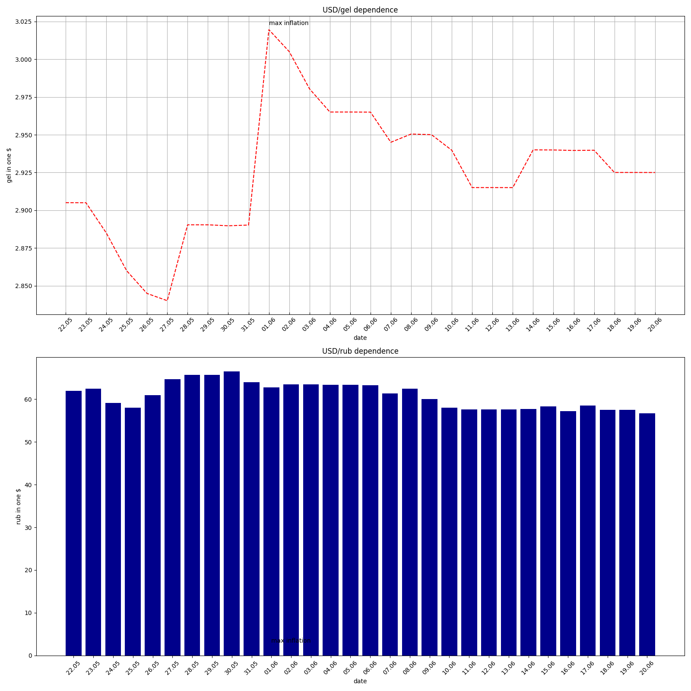

### Задание:
реализовать скрипт который:
1) получает курсы валют относительно друг друга за последние 30 дней (предлагаем Usd/Rub,
   Gel/Rub)
2) отображает полученные значения на графике (формат любой на ваш выбор, главное чтобы
   данные были понятны)
3) создает PDF документ в котором представлены:
- полученные графики
- минимальное, максимальное, среднее значение за период
  Результатом выполнения являются:
- скрипт (код должен быть лаконичен, понятен, оптимизирован)
- полученный pdf файл
- инструкция по запуску (README.md, requirements.txt - на усмотрение кандидата)
- все это выложено на github/gitlab

======

###  Реализация 

Запустить файл main.py

Построятся графики usd\gel и usd\rub

Сформируется pdf.

Пример графика

Пример сформированного pdf: [canvas_image.pdf](canvas_image.pdf)